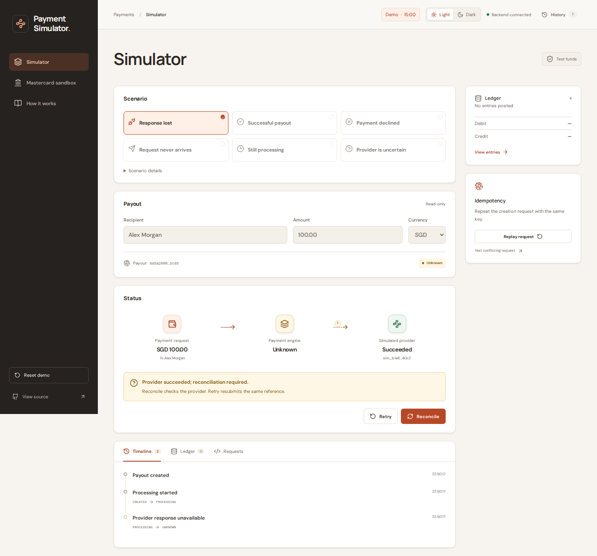
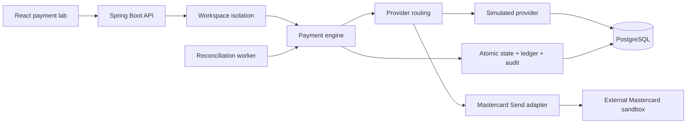

# Payment Processing Simulator

[](https://github.com/yyan115/payment-processing-simulator/actions/workflows/ci.yml)
[](https://github.com/yyan115/payment-processing-simulator/actions/workflows/codeql.yml)

**What happens when a payment succeeds, but its confirmation never arrives?**

An interactive payment lab built with Java 21, Spring Boot, PostgreSQL and React. Send a payout, lose a response, inspect what each system knows, and recover without paying twice. Every action runs through the backend and database.



## Try it

```bash
docker compose up --build
```

Open **http://localhost:8080**. Docker builds the frontend into the Java application and starts PostgreSQL. No provider credentials are needed for the simulator.

1. Keep **Response lost** selected and create a payout.
2. Click **Send payout**. The provider succeeds, but the app records `UNKNOWN`. The ledger is empty.
3. Click **Reconcile payment**. The app discovers the success and records one balanced journal.
4. Replay the original request. You still have one payout. Change the request under the same key and the API returns `409`.

Each visitor gets a private 15-minute workspace. **Start fresh** begins another session. Automatic reconciliation is paused in the demo so you can inspect and resolve uncertainty yourself.

## Two providers, one payment engine

| View | What you can do | Where the outcome comes from |
| --- | --- | --- |
| **Simulator** | Control six failure scenarios; compare the app’s state with the provider’s record; retry and reconcile | A deterministic provider with its own PostgreSQL records |
| **Mastercard sandbox** | Submit an authenticated test payout and look it up using Mastercard Send | Mastercard’s external sandbox API, which returns simulated responses |
| **How it works** | Learn payout lifecycles, idempotency, uncertainty and double-entry records | Explanations tied to the working implementation |

The Mastercard view uses the same state machine, duplicate protection, audit history and ledger. Each payout keeps its provider selection for processing and recovery. Credentials stay on the server. See the [integration guide](docs/mastercard.md) to enable it.

An authenticated Mastercard sandbox payout and signed reference lookup were verified on **2026-09-27**, including the browser workflow, one balanced journal and creation-request replay. This verifies a sandbox integration; it does not represent real funds movement or production settlement.

## The engineering problem

```text
Your payment engine                     Provider
       | ------ pay SGD 100 ---------->    |
       |                                   | records success
       | <--------- confirmation --------- X
       | timeout
       | local state: UNKNOWN
       | ledger: empty                     | provider state: SUCCEEDED
```

A timeout describes missing evidence. It does not establish failure. A fresh payment reference could duplicate a payment that already succeeded.

This project preserves uncertainty, keeps the original reference for safe repeats, and uses reconciliation to ask the provider what happened. Only confirmed success produces a financial journal.

## Architecture



One deployable application serves the UI and API. PostgreSQL stores payout intent, independent provider records, financial journals, audit history and temporary workspaces. [Design notes](docs/design.md) explain the invariants and transaction boundaries.

## Correctness properties

- **Idempotent creation:** the same key, payment intent and provider return the original payout; changed intent returns `409`.
- **Concurrency protection:** unique constraints and optimistic locking prevent duplicate provider records and journal transactions under competing requests.
- **Explicit uncertainty:** timeouts and ambiguous integration failures preserve `UNKNOWN`; they are not invented declines.
- **Safe repeats:** the stable payout reference survives retries. The Mastercard adapter sends `repeat-flag: true` for deliberate repeats.
- **Recovery:** manual reconciliation and an optional scheduled worker resolve uncertain or stale `PROCESSING` payouts. Automatic checks use bounded exponential backoff.
- **Atomic confirmation:** a successful state transition, audit event and two ledger entries commit in the same database transaction.
- **Database-enforced balance:** deferred constraints require matching debit/credit amounts and currency. A payout can have only one journal.
- **Immutable records:** updates to journal and audit rows are rejected. Ordinary records cannot be deleted; explicitly temporary, expired demo workspaces have a bounded cleanup path.
- **Visitor isolation:** server-enforced ownership, namespaced idempotency keys, admission limits and payout quotas separate demo workspaces.

## Failure scenarios

| Situation | Provider record | App after sending | Recovery |
| --- | --- | --- | --- |
| Successful payout | `SUCCEEDED` | `SUCCEEDED`, journal posted | None needed |
| Payment declined | `DECLINED` | `FAILED`, no journal | None needed |
| Response lost | `SUCCEEDED` | `UNKNOWN`, no journal | Reconcile or safely repeat |
| Request never arrives | None | `UNKNOWN`, no journal | Lookup remains uncertain; safe repeat can submit |
| Still processing | `PENDING` | `UNKNOWN`, no journal | Finish at provider, then reconcile |
| Provider is uncertain | `UNKNOWN` | `UNKNOWN`, no journal | Await provider evidence, then reconcile |

The UI shows persisted evidence, including events, reconciliation attempts, journal entries and actual API receipts. It does not manufacture payment results in JavaScript.

## Run, test and deploy

- [Local development and tests](docs/development.md): Java 21, Node 22, PostgreSQL 17; no Docker requirement for the application itself.
- [API walkthrough](docs/api.md): create, process, retry, reconcile and inspect a payout with curl.
- [Mastercard integration](docs/mastercard.md): credentials, test parties, signed requests and the verification boundary.
- [Free deployment](docs/deployment.md): one Render Free web service plus a Neon Free database, with a checked-in `render.yaml`.

The deployment configuration is prepared; this repository does not claim an existing public deployment. Free hosts have quotas and cold starts.

The test suite covers money precision, REST contracts, concurrent idempotency and processing, provider routing, crash recovery, immutable balanced journals, session isolation and expiry. Playwright runs the actual packaged application through all six scenarios, duplicate requests and mobile navigation. CI uses generated keys and local fixtures for Mastercard contract tests; an opt-in browser test checks a privately configured live sandbox.

## Operations

The default demo disables automatic reconciliation and limits records to each workspace. For a persistent local lab with automatic recovery and Prometheus:

```bash
DEMO_ENABLED=false RECONCILIATION_ENABLED=true docker compose --profile observability up --build
```

The app runs at http://localhost:8080 and Prometheus at http://localhost:9090. Health is available at `/actuator/health`; metrics at `/actuator/prometheus` are hidden in demo mode. Alerts cover unresolved `UNKNOWN` and stale `PROCESSING` payouts.

## Scope

This models payout confirmation, uncertainty, recovery and a simplified seller-payable/cash-clearing journal. It does not model card-purchase authorization, fees, foreign exchange, bank settlement, or reversals after confirmation. A later reversal would need a separate lifecycle and compensating journal entries, preserving the original history.

Use synthetic data and official sandbox fixtures only. See [Security](SECURITY.md).
