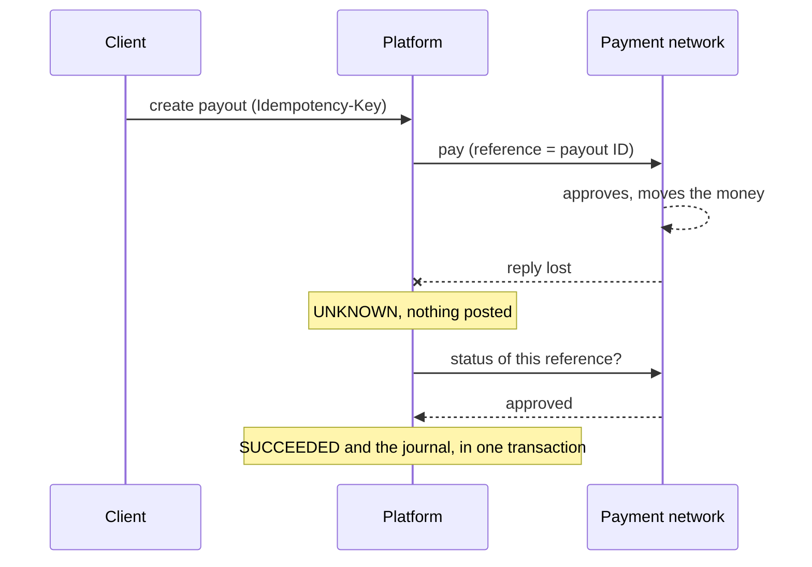
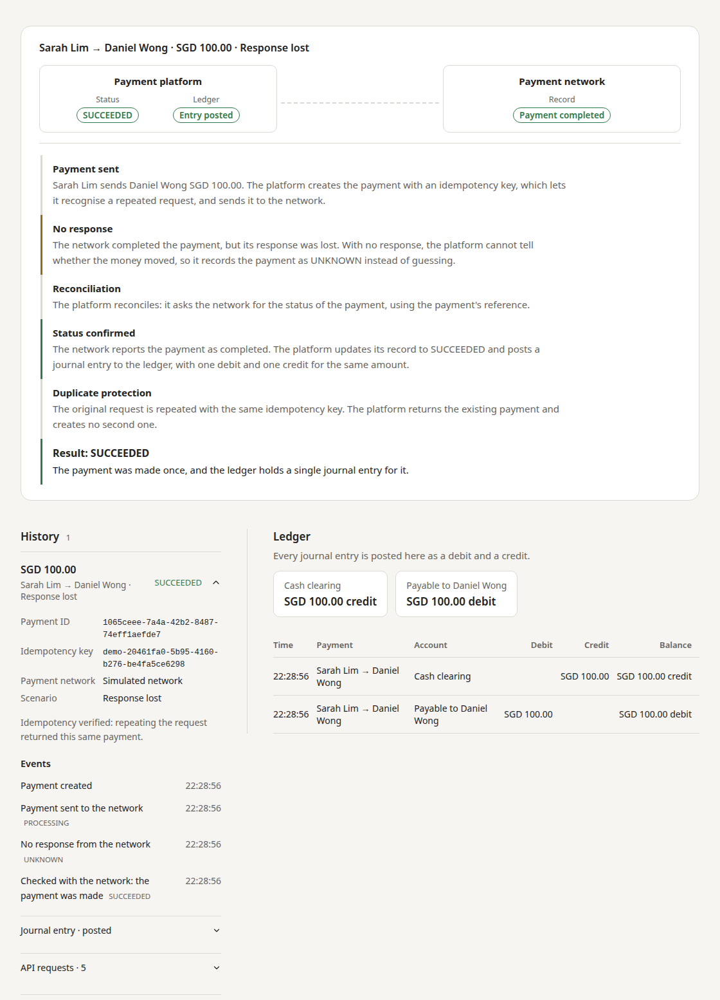

# Payment Processing Simulator

[](https://github.com/yyan115/payment-processing-simulator/actions/workflows/ci.yml)
[](https://github.com/yyan115/payment-processing-simulator/actions/workflows/codeql.yml)

A payment platform that stays correct when the payment network fails. It sends payouts with idempotency keys, records an explicit `UNKNOWN` state when the outcome is not known, recovers by reconciliation, and keeps a double-entry ledger in PostgreSQL. It runs on Java 21 and Spring Boot, with a React demo that shows each failure step by step. Besides a simulated network, it pays through the Mastercard Send and Visa Direct sandboxes.

**[Live demo](https://payment-simulator.redforest-1d69de67.eastasia.azurecontainerapps.io)**


## The problem

When a request to a payment network times out, the platform cannot tell whether the network paid. Sending again can pay twice. Giving up can lose the payment. This project handles that case: it records `UNKNOWN`, asks the network what happened using the payout's own reference, and only then finishes the payout.



## Techniques

| Concern | Technique | Code |
| --- | --- | --- |
| Duplicate requests | Idempotency key with a request fingerprint and a unique constraint. A changed request under the same key returns 409. | [`PayoutService`](src/main/java/dev/yycodes/paymentsimulator/payout/PayoutService.java) |
| Paying twice | The payout's UUID is the network reference. Mastercard resends use `Repeat-Flag`, Visa resends reuse derived identifiers. | [`provider/`](src/main/java/dev/yycodes/paymentsimulator/provider) |
| Unknown outcomes | Timeouts and unexpected errors become `UNKNOWN`, never `FAILED`. | [`PayoutProcessor`](src/main/java/dev/yycodes/paymentsimulator/payout/PayoutProcessor.java) |
| Recovery | Reconciliation by reference, with a worker that backs off exponentially. | [`reconciliation/`](src/main/java/dev/yycodes/paymentsimulator/reconciliation) |
| Ledger correctness | The journal posts in the same transaction as the status change. Deferred PostgreSQL triggers reject an unbalanced journal, and ledger and audit rows cannot be edited. | [`ledger/`](src/main/java/dev/yycodes/paymentsimulator/ledger), [migrations](src/main/resources/db/migration) |
| Concurrency | Optimistic locking, unique constraints and repeatable-read snapshots. | [`Payout`](src/main/java/dev/yycodes/paymentsimulator/payout/Payout.java) |
| Exact money | `BigDecimal` and `NUMERIC`, conversion to minor units without rounding. | [`MoneyAmounts`](src/main/java/dev/yycodes/paymentsimulator/shared/MoneyAmounts.java) |
| A public demo | Isolated workspaces, rate limits, sandbox call budgets and an optional Turnstile check. | [`demo/`](src/main/java/dev/yycodes/paymentsimulator/demo) |

The design, with state diagrams and the reasoning behind each choice, is in [docs/architecture.md](docs/architecture.md).

## Scenarios

The demo lets you choose what the simulated network does, then shows how the platform responds.

| Scenario | The network | The platform |
| --- | --- | --- |
| Approved | Approves | `SUCCEEDED`, journal posted |
| Declined | Declines | `FAILED`, nothing posted |
| Response lost | Pays, but the reply is lost | `UNKNOWN`, reconciles, finds the payment, `SUCCEEDED` |
| Request lost | Never receives the request | `UNKNOWN`, reconciles, finds nothing, sends again with the same reference |
| Pending | Has not finished | `UNKNOWN`, waits, reconciles |
| Unknown outcome | Cannot report a result | Stays `UNKNOWN` and does not send again |

Choose the Mastercard or Visa sandbox as the network to send a real sandbox payment through the same state machine and ledger.



## Run it

```bash
docker compose up --build
```

Open <http://localhost:8080>. Mastercard and Visa are optional and need sandbox credentials, see [Mastercard](docs/mastercard.md) and [Visa](docs/visa.md).

## Tests

- **Backend:** integration tests on real PostgreSQL covering concurrent requests, database triggers, recovery and the Mastercard and Visa contracts.
- **Frontend:** unit tests and Playwright browser tests. One suite runs every scenario with every sender, recipient and playback mode, on desktop and phone.
- **CI:** formatting, all tests, a smoke test and the browser tests against the packaged container, plus CodeQL.

## Documentation

[Architecture](docs/architecture.md) · [API](docs/api.md) · [Development](docs/development.md) · [Deployment](docs/deployment.md) · [Mastercard](docs/mastercard.md) · [Visa](docs/visa.md) · [Security](SECURITY.md)

## Stack

Java 21, Spring Boot 4, PostgreSQL 17, Flyway, React 19, TypeScript, Vite, Playwright, Docker, GitHub Actions, Azure Container Apps.

## License

[MIT](LICENSE)
