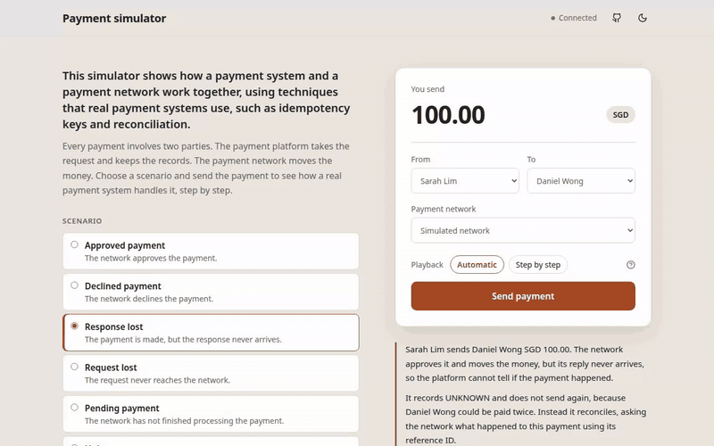

# Payment Processing Simulator

A payment platform simulator built with Java and Spring Boot, with a React front-end demo. It showcases scenarios that may happen in a payment process, using real-world payment techniques such as idempotency keys, reconciliation and a double-entry ledger.

It also has Mastercard Send API and Visa Direct API sandbox integrations.

**[Live demo](https://payment-simulator.redforest-1d69de67.eastasia.azurecontainerapps.io)**



## Scenarios

The demo runs six scenarios. They are the situations a payment platform handles when it sends a payment to a payment network. Choose one, send a payment, and the demo shows each step. A payment is marked UNKNOWN when the platform cannot tell what the network did with it.

- **Approved payment:** The network approves the payment and the platform records it as successful.
- **Declined payment:** The network declines the payment, for example because of insufficient funds, and the platform records it as failed.
- **Response lost:** The network pays but its reply never arrives. The platform marks the payment UNKNOWN, asks the network what happened, finds the payment and records it as successful.
- **Request lost:** The request never reaches the network. The platform marks the payment UNKNOWN, asks the network, finds no record and sends the payment again.
- **Pending payment:** The network has not finished processing. The platform marks the payment UNKNOWN, waits and asks again.
- **Unknown outcome:** The network cannot report a result. The platform keeps the payment UNKNOWN and does not send it again.

## Techniques

The platform uses these techniques to handle the scenarios. Real payment systems rely on the same ones.

**Idempotency key:** The client sends an idempotency key with every payment request, which makes the request safe to repeat. If the same request arrives twice, for example after a client timeout, the platform returns the first payment instead of creating a second one. If the same key arrives with a different amount or recipient, the platform rejects the request.

**Payment reference:** Every request to the payment network carries the platform's own ID for the payment, or identifiers derived from it. When the platform sends a payment again, the network recognises the ID and does not pay twice. The platform also uses the ID to ask the network about the payment later.

**UNKNOWN status:** A timeout does not tell the platform whether the network paid, so the platform does not mark the payment as failed. It marks the payment UNKNOWN until it can find out.

**Reconciliation:** To settle an UNKNOWN payment, the platform asks the network about it using the payment reference. An approval completes the payment and a decline fails it. If the network has no record, the request never arrived and the platform can send the payment again. The demo triggers the check from the page. With the optional background worker enabled, the platform repeats the check by itself with growing delays.

**Double-entry ledger:** A successful payment posts a journal entry with a debit and a credit for the same amount. The platform saves it in the same database transaction as the status change, so a payment never succeeds without its journal entry. PostgreSQL rejects journal entries that do not balance and edits to saved ones.

**Concurrency control:** Two requests can try to process the same payment at the same time. Optimistic locking and unique database constraints let only one of them succeed.

**Exact amounts:** The backend stores amounts as `BigDecimal` and `NUMERIC` and converts them to minor units without rounding.

## Project structure

The React demo calls the platform's REST API. The platform stores payments, ledger entries and audit events in PostgreSQL, and it sends each payment to a payment network through an adapter. GitHub Actions runs the tests on every push, builds a container image and deploys it to Azure Container Apps, where the live demo runs.

```
src/main/java/.../payout/            Payments (called payouts in the API): creation, sending and status changes
src/main/java/.../provider/          Network adapters: simulated, Mastercard Send, Visa Direct
src/main/java/.../ledger/            Journal entries and queries
src/main/java/.../reconciliation/    Reconciliation worker and attempt records
src/main/java/.../audit/             Audit events
src/main/java/.../demo/              Workspaces, rate limits and sandbox call budgets
src/main/resources/db/migration/     Flyway migrations, including the ledger and audit triggers
frontend/                            React demo and Playwright tests
ops/                                 Deployment scripts and Prometheus config
scripts/                             Smoke test and the script that records the GIF
.github/workflows/                   Tests, image build and deployment
```

## Run it

```
docker compose up --build
```

Open http://localhost:8080. The Mastercard and Visa sandboxes need credentials. Copy `.env.example` to `.env`, fill in the values and start the app with the sandbox files.

```
docker compose -f docker-compose.yml -f docker-compose.mastercard.yml -f docker-compose.visa.yml up --build
```

## Build it

You need Java 21, Maven, Node 22 and Docker.

```
docker run -d -p 5432:5432 -e POSTGRES_USER=payments -e POSTGRES_PASSWORD=payments -e POSTGRES_DB=payments postgres:17-alpine
DEMO_ENABLED=true mvn spring-boot:run
cd frontend && npm ci && npm run dev
```

The app runs at http://127.0.0.1:5173. Run the tests with `mvn verify`, `npm test` and `npm run test:e2e`. The browser tests open many workspaces, so start the backend with `DEMO_ADMISSIONS_PER_MINUTE=120` for them.

---

Built by Yan Yu.

Copyright (c) 2026 Yan Yu

Permission to use, copy, modify, and/or distribute this software for any purpose with or without fee is hereby granted, provided that the above copyright notice and this permission notice appear in all copies.

THE SOFTWARE IS PROVIDED "AS IS" AND THE AUTHOR DISCLAIMS ALL WARRANTIES WITH REGARD TO THIS SOFTWARE. IN NO EVENT SHALL THE AUTHOR BE LIABLE FOR ANY DAMAGES ARISING OUT OF OR IN CONNECTION WITH THE USE OR PERFORMANCE OF THIS SOFTWARE.
