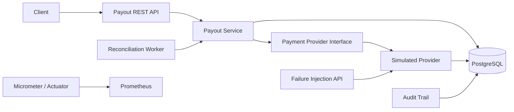

# Payment Processing Simulator

[](https://github.com/yyan115/payment-processing-simulator/actions/workflows/ci.yml)

A Java/Spring Boot payment backend that explores a deceptively hard problem: **what should a financial system do when an external payment may have succeeded, but the response never arrives?**

The project models idempotent payout creation, strict lifecycle transitions, ambiguous external outcomes, safe retries, automated reconciliation, concurrency protection, audit history, and operational monitoring.

## The failure this project is built around

A provider can commit a S$100 payout and then lose the response on the way back:

```text
Payment service                         Provider
      |                                    |
      | -------- payout S$100 ---------->  |
      |                                    | commits SUCCEEDED
      | <--------- response -------------- X
      |
      | timeout
```

A timeout does **not** prove the payout failed. Retrying blindly can pay the recipient twice.

This simulator therefore records the local payout as `UNKNOWN`, preserves the provider-side result separately, and supports either reconciliation or an explicitly marked repeat request.

## Architecture



Failure injection is deliberately separated from the business payout API. The provider sits behind a `PaymentProvider` interface so a real external adapter can replace the simulator without moving payment-state rules into integration code.

## Correctness properties

- **Idempotent creation:** the same `Idempotency-Key` and request intent return the original payout.
- **Key misuse detection:** reusing an idempotency key for a different amount, currency, or recipient is rejected.
- **Legal state transitions:** payout state changes are enforced inside the domain model.
- **Concurrent-write protection:** JPA optimistic locking prevents conflicting state updates.
- **Unknown is not failed:** transport timeouts preserve uncertainty instead of inventing a business outcome.
- **Safe retry:** a repeated provider submission can return the original provider transaction instead of creating another payout.
- **Reconciliation:** uncertain payouts are checked against durable provider records.
- **Auditability:** state transitions and reconciliation attempts are persisted.
- **Operational visibility:** logs, Prometheus metrics, health checks, and an alert for unresolved unknown payouts are included.

See [Design notes](docs/design.md) for the invariants and failure model.

## Mastercard-specific alignment

Mastercard Send added a `repeat-flag` request header for Disbursement, P2P Payment Transfer, and Funding APIs. Mastercard documents that a request can be resent with `repeat-flag: true` after no response or an `UNKNOWN` status so the repeated request can be identified and duplicate financial impact avoided.

This simulator models that behavior explicitly:

```text
ORIGINAL submission -> provider may succeed -> response lost -> local UNKNOWN

RETRY submission
    -> provider already has client reference -> return original result
    -> provider has no record              -> process once
```

Source: [Mastercard Send Release Notes 25.2](https://static.developer.mastercard.com/content/mastercard-send/release-notes/mastercard-send-release-notes-25.2.pdf)

## Failure scenarios

| Simulated provider outcome | Provider record | Local result after processing | Reconciliation / retry |
| --- | --- | --- | --- |
| `SUCCESS` | `SUCCEEDED` | `SUCCEEDED` | Not needed |
| `DECLINED` | `DECLINED` | `FAILED` | Not needed |
| `TIMEOUT_AFTER_SUCCESS` | `SUCCEEDED` | `UNKNOWN` | Resolves or safely retries to `SUCCEEDED` |
| `TIMEOUT_BEFORE_PROCESSING` | none | `UNKNOWN` | Reconciliation remains unknown; retry processes once |

## Stack

- Java 21
- Spring Boot 4.1
- PostgreSQL 17
- Spring Data JPA with optimistic locking
- Flyway database migrations
- Micrometer + Prometheus
- Docker Compose
- Maven
- GitHub Actions

## Run everything

```bash
docker compose up --build
```

Services:

- API: http://localhost:8080
- Health: http://localhost:8080/actuator/health
- Prometheus metrics: http://localhost:8080/actuator/prometheus
- Prometheus UI: http://localhost:9090

## Demo

### 1. Create an idempotent payout

```bash
curl -i -X POST http://localhost:8080/api/v1/payouts \
  -H 'Content-Type: application/json' \
  -H 'Idempotency-Key: demo-payout-001' \
  -d '{"recipientReference":"seller-42","amount":100.00,"currency":"SGD"}'
```

Save the returned `id`.

### 2. Configure the simulator to lose the response after provider success

```bash
curl -i -X PUT http://localhost:8080/api/v1/simulation/payouts/<PAYOUT_ID>/next-outcome \
  -H 'Content-Type: application/json' \
  -d '{"outcome":"TIMEOUT_AFTER_SUCCESS"}'
```

### 3. Process the payout

```bash
curl -X POST http://localhost:8080/api/v1/payouts/<PAYOUT_ID>/process
```

The local payout becomes `UNKNOWN`, while the simulated provider has already persisted a successful transaction.

### 4A. Reconcile

```bash
curl -X POST http://localhost:8080/api/v1/payouts/<PAYOUT_ID>/reconcile
```

or:

### 4B. Safely retry the original provider submission

```bash
curl -X POST http://localhost:8080/api/v1/payouts/<PAYOUT_ID>/retry
```

For `TIMEOUT_AFTER_SUCCESS`, retry returns the already-created provider transaction and does not create a second one.

### 5. Inspect the audit trail

```bash
curl http://localhost:8080/api/v1/payouts/<PAYOUT_ID>/events
```

## Testing

```bash
mvn verify
```

Integration tests verify:

- repeat requests do not create duplicate payouts
- concurrent requests using the same idempotency key create exactly one payout
- an idempotency key cannot be reused for different request intent
- provider declines become failures
- timeout after provider success resolves through reconciliation
- timeout before provider processing remains explicitly unresolved
- safe retry after lost success does not create a duplicate provider transaction
- safe retry after pre-processing timeout creates exactly one provider transaction
- audit and reconciliation records match state transitions

CI runs the suite on every push and pull request.

## Observability

The application publishes payment-specific metrics through Actuator, including provider results, ambiguous timeouts, reconciliation outcomes, and the current count of `UNKNOWN` payouts.

Prometheus configuration lives under `ops/prometheus/`. The included `UnknownPayoutStuck` rule fires when an ambiguous payout remains unresolved.

## Mastercard sandbox integration

The intended external adapter is Mastercard Send Disbursements. Mastercard's developer platform currently lists the Send Disbursements sandbox, and Mastercard's official Java OAuth 1.0a signing library uses a Developers project, consumer key, and private request-signing key.

The repository does **not** claim a live Mastercard integration until sandbox credentials are configured and an end-to-end request is verified. The simulator remains useful after that integration because it can deterministically reproduce failure cases an external sandbox may not expose.
