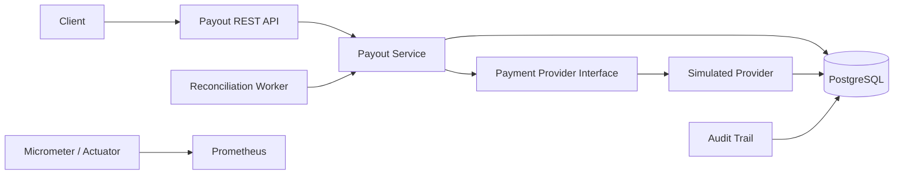

# Payment Processing Simulator

[](https://github.com/yyan115/payment-processing-simulator/actions/workflows/ci.yml)

A Java/Spring Boot payment backend that explores a deceptively hard problem: **what should a financial system do when an external payment may have succeeded, but the response never arrives?**

The project models idempotent payout creation, strict lifecycle transitions, ambiguous external outcomes, automated reconciliation, concurrency protection, audit history, and operational monitoring.

## The failure this project is built around

A provider can commit a S$100 payout and then lose the response on the way back:

```text
Payment service                         Provider
      |                                    |
      | -------- payout S$100 ---------->  |
      |                                    | commits SUCCEEDED
      | <--------- response -------------- X
      |
      | timeout
```

A timeout does **not** prove the payout failed. Retrying blindly can pay the recipient twice.

This simulator therefore records the local payout as `UNKNOWN`, preserves the provider-side result separately, and reconciles the two views before deciding the final state.

## Architecture



The simulated provider is intentionally behind a `PaymentProvider` interface so an external provider adapter can replace it without moving payment-state rules into integration code.

## Correctness properties

- **Idempotent creation:** the same `Idempotency-Key` and request intent return the original payout.
- **Key misuse detection:** reusing an idempotency key for a different amount, currency, or recipient is rejected.
- **Legal state transitions:** payout state changes are enforced inside the domain model.
- **Concurrent-write protection:** JPA optimistic locking prevents conflicting state updates.
- **Unknown is not failed:** transport timeouts preserve uncertainty instead of inventing a business outcome.
- **Reconciliation:** uncertain payouts are checked against durable provider records.
- **Auditability:** state transitions and reconciliation attempts are persisted.
- **Operational visibility:** logs, Prometheus metrics, health checks, and an alert for unresolved unknown payouts are included.

See [Design notes](docs/design.md) for the invariants and failure model.

## Failure scenarios

| Simulated provider outcome | Provider record | Local result after processing | Reconciliation |
| --- | --- | --- | --- |
| `SUCCESS` | `SUCCEEDED` | `SUCCEEDED` | Not needed |
| `DECLINED` | `DECLINED` | `FAILED` | Not needed |
| `TIMEOUT_AFTER_SUCCESS` | `SUCCEEDED` | `UNKNOWN` | Resolves to `SUCCEEDED` |
| `TIMEOUT_BEFORE_PROCESSING` | none | `UNKNOWN` | Remains `STILL_UNKNOWN` |

The two timeout cases deliberately look identical to the caller at first. Reconciliation is what distinguishes them.

## Stack

- Java 21
- Spring Boot 4.1
- PostgreSQL 17
- Spring Data JPA with optimistic locking
- Flyway database migrations
- Micrometer + Prometheus
- Docker Compose
- Maven
- GitHub Actions

## Run everything

```bash
docker compose up --build
```

Services:

- API: http://localhost:8080
- Health: http://localhost:8080/actuator/health
- Prometheus metrics: http://localhost:8080/actuator/prometheus
- Prometheus UI: http://localhost:9090

To run only PostgreSQL and start the application from Maven:

```bash
docker compose up -d postgres
mvn spring-boot:run
```

## Demo

### 1. Create an idempotent payout

```bash
curl -i -X POST http://localhost:8080/api/v1/payouts \
  -H 'Content-Type: application/json' \
  -H 'Idempotency-Key: demo-payout-001' \
  -d '{"recipientReference":"seller-42","amount":100.00,"currency":"SGD"}'
```

Save the returned `id`.

Repeating the exact request with the same idempotency key returns the same payout instead of creating another one.

### 2. Simulate success with a lost response

```bash
curl -X POST http://localhost:8080/api/v1/payouts/<PAYOUT_ID>/process \
  -H 'Content-Type: application/json' \
  -d '{"outcome":"TIMEOUT_AFTER_SUCCESS"}'
```

The local payout becomes `UNKNOWN`. The provider has already persisted a successful transaction.

### 3. Reconcile

```bash
curl -X POST http://localhost:8080/api/v1/payouts/<PAYOUT_ID>/reconcile
```

The response reports `RESOLVED_SUCCEEDED` and the payout becomes `SUCCEEDED`.

Automatic reconciliation also runs periodically when enabled.

### 4. Inspect the audit trail

```bash
curl http://localhost:8080/api/v1/payouts/<PAYOUT_ID>/events
```

For the timeout-after-success path, the state history is:

```text
CREATED
  -> PROCESSING   PROCESSING_STARTED
  -> UNKNOWN      PROVIDER_TIMEOUT
  -> SUCCEEDED    RECONCILIATION_SUCCEEDED
```

## Testing

```bash
mvn verify
```

Integration tests use PostgreSQL and verify:

- repeat requests do not create duplicate payouts
- concurrent requests using the same idempotency key create exactly one payout
- an idempotency key cannot be reused for different request intent
- provider declines become failures
- a timeout after provider success reconciles correctly
- a timeout before provider processing remains explicitly unresolved
- audit and reconciliation records match the state transitions

CI runs the suite on every push and pull request.

## Observability

The application publishes payment-specific metrics through Actuator, including:

- provider result counts
- ambiguous timeout counts
- reconciliation outcomes
- current number of `UNKNOWN` payouts

Prometheus configuration lives under `ops/prometheus/`. The included `UnknownPayoutStuck` rule fires when an ambiguous payout remains unresolved.

## Mastercard integration

The next external adapter is **Mastercard Send Disbursements**. Mastercard currently provides a sandbox for the API, and Mastercard's Java OAuth 1.0a signing library requires a Developers project, consumer key, and private request-signing key.

The repository does **not** claim a live Mastercard integration until those credentials are configured and an end-to-end sandbox request is verified. The simulator remains the deterministic failure-injection environment for cases that an external sandbox cannot reliably reproduce.
