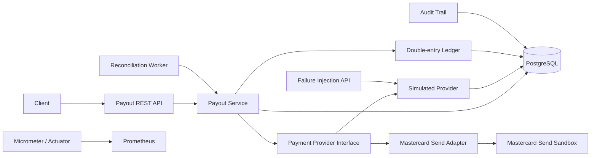

# Payment Processing Simulator

[](https://github.com/yyan115/payment-processing-simulator/actions/workflows/ci.yml)
[](https://github.com/yyan115/payment-processing-simulator/actions/workflows/codeql.yml)

A Java/Spring Boot payment backend that explores a deceptively hard problem: **what should a financial system do when an external payment may have succeeded, but the response never arrives?**

The project models idempotent payout creation, strict lifecycle transitions, ambiguous external outcomes, safe retries, automated reconciliation, concurrency protection, double-entry financial records, audit history, and operational monitoring.

## The failure this project is built around

A provider can commit a S$100 payout and then lose the response on the way back:

```text
Payment service                         Provider
      |                                    |
      | -------- payout S$100 ---------->  |
      |                                    | commits SUCCEEDED
      | <--------- response -------------- X
      |
      | timeout
```

A timeout does **not** prove the payout failed. Retrying blindly can pay the recipient twice.

This simulator therefore records the local payout as `UNKNOWN`, preserves the provider-side result separately, and supports either reconciliation or an explicitly marked repeat request.

## Architecture



Failure injection is deliberately separated from the business payout API. The provider sits behind a `PaymentProvider` interface so a real external adapter can replace the simulator without moving payment-state rules into integration code.

## Correctness properties

- **Idempotent creation:** the same `Idempotency-Key` and request intent return the original payout.
- **Key misuse detection:** reusing an idempotency key for a different amount, currency, or recipient is rejected.
- **Legal state transitions:** payout state changes are enforced inside the domain model.
- **Concurrent-write protection:** JPA optimistic locking prevents conflicting state updates.
- **Unknown is not failed:** transport timeouts preserve uncertainty instead of inventing a business outcome.
- **Safe retry:** a repeated provider submission can return the original provider transaction instead of creating another payout.
- **Reconciliation:** uncertain payouts are checked against durable provider records, converge as asynchronous provider status changes, and use bounded exponential backoff for automatic retries.
- **Crash-window recovery:** stale `PROCESSING` payouts are reconciled so provider success cannot be stranded by a failed local finalization write.
- **Double-entry posting:** successful payouts atomically create equal debit and credit ledger entries.
- **Database-enforced balance:** a deferred PostgreSQL constraint trigger rejects imbalanced or cross-currency journals at commit.
- **Append-only journal:** PostgreSQL rejects updates and deletes against committed ledger rows.
- **No premature posting:** failed and unresolved payouts create no financial journal entry.
- **Auditability:** state transitions and reconciliation attempts are persisted.
- **Operational visibility:** logs, Prometheus metrics, health checks, and alerts for unresolved `UNKNOWN` and stale `PROCESSING` payouts are included.

See [Design notes](docs/design.md) for the invariants and failure model.

## Mastercard-specific alignment

Mastercard Send added a `repeat-flag` request header for Disbursement, P2P Payment Transfer, and Funding APIs. Mastercard documents that a request can be resent with `repeat-flag: true` after no response or an `UNKNOWN` status so the repeated request can be identified and duplicate financial impact avoided.

This simulator models that behavior explicitly:

```text
ORIGINAL submission -> provider may succeed -> response lost -> local UNKNOWN

RETRY submission
    -> provider already has client reference -> return original result
    -> provider has no record              -> process once
```

Source: [Mastercard Send Release Notes 25.1](https://static.developer.mastercard.com/content/mastercard-send/release-notes/mastercard-send-release-notes-25.1.pdf)

## Financial journal

A payout does not enter the ledger until its external outcome is known to be successful.

A confirmed S$100 payout creates one immutable journal transaction:

```text
DEBIT   SELLER_PAYABLE:seller-42   SGD 100
CREDIT  CASH_CLEARING              SGD 100
```

The payout state transition and ledger posting share one database transaction. If the financial posting fails, the payout cannot commit as `SUCCEEDED`.

The payout ID is unique in `ledger_transactions`, preventing the same payout from being financially posted twice. PostgreSQL also validates the two-line debit/credit balance at transaction commit.

Inspect a confirmed payout:

```bash
curl http://localhost:8080/api/v1/payouts/<PAYOUT_ID>/ledger
```

## Failure scenarios

| Simulated provider outcome | Provider record | Local result after processing | Financial posting | Reconciliation / retry |
| --- | --- | --- | --- | --- |
| `SUCCESS` | `SUCCEEDED` | `SUCCEEDED` | debit + credit | Not needed |
| `DECLINED` | `DECLINED` | `FAILED` | none | Not needed |
| `UNKNOWN` | `UNKNOWN` | `UNKNOWN` | none | Provider state can later become success/failure and reconciliation resolves it |
| `PENDING` | `PENDING` | `UNKNOWN` | none | Provider state can later become success/failure and reconciliation resolves it |
| `TIMEOUT_AFTER_SUCCESS` | `SUCCEEDED` | `UNKNOWN` | none until resolved | Resolves or safely retries to `SUCCEEDED` |
| `TIMEOUT_BEFORE_PROCESSING` | none | `UNKNOWN` | none | Reconciliation remains unknown; retry processes once |

## Stack

- Java 21
- Spring Boot 4.1
- PostgreSQL 17
- Spring Data JPA with optimistic locking
- Flyway database migrations
- Micrometer + Prometheus
- Docker Compose
- Maven
- Mastercard OAuth 1.0a signer
- GitHub Actions

## Run everything

```bash
docker compose up --build
```

Services:

- API: http://localhost:8080
- Health: http://localhost:8080/actuator/health
- Prometheus metrics: http://localhost:8080/actuator/prometheus
- Prometheus UI: http://localhost:9090

## Demo

### 1. Create an idempotent payout

```bash
curl -i -X POST http://localhost:8080/api/v1/payouts \
  -H 'Content-Type: application/json' \
  -H 'Idempotency-Key: demo-payout-001' \
  -d '{"recipientReference":"seller-42","amount":100.00,"currency":"SGD"}'
```

Save the returned `id`.

### 2. Configure the simulator to lose the response after provider success

```bash
curl -i -X PUT http://localhost:8080/api/v1/simulation/payouts/<PAYOUT_ID>/next-outcome \
  -H 'Content-Type: application/json' \
  -d '{"outcome":"TIMEOUT_AFTER_SUCCESS"}'
```

### 3. Process the payout

```bash
curl -X POST http://localhost:8080/api/v1/payouts/<PAYOUT_ID>/process
```

The local payout becomes `UNKNOWN`. No ledger entry is created because the application does not yet know the business outcome.

### 4. Resolve the ambiguity

Reconcile:

```bash
curl -X POST http://localhost:8080/api/v1/payouts/<PAYOUT_ID>/reconcile
```

or safely repeat the provider submission:

```bash
curl -X POST http://localhost:8080/api/v1/payouts/<PAYOUT_ID>/retry
```

The payout becomes `SUCCEEDED` and exactly one balanced ledger transaction is posted.

### 5. Inspect evidence

```bash
curl http://localhost:8080/api/v1/payouts/<PAYOUT_ID>/events
curl http://localhost:8080/api/v1/payouts/<PAYOUT_ID>/ledger
```

## Testing

```bash
mvn verify
```

Tests cover the public REST contract, idempotency and concurrent creation, asynchronous provider-state convergence, failure semantics, crash-window recovery, reconciliation, safe repeats, balanced ledger posting, maximum-length recipient handling, concurrent processing, and the Mastercard adapter's signed request contract.

CI runs the suite on every push and pull request.

## Observability

The application publishes payment-specific metrics through Actuator, including provider results, ambiguous timeouts, reconciliation outcomes, the current count of `UNKNOWN` payouts, and stale `PROCESSING` payouts that have crossed the recovery threshold.

Prometheus configuration lives under `ops/prometheus/`. The included `UnknownPayoutStuck` and `ProcessingPayoutStuck` rules surface unresolved ambiguity and crash-window recovery failures.

## Mastercard Send adapter

The project includes a selectable Mastercard Send Disbursements adapter using Mastercard's official OAuth 1.0a Java signer, the current RNTZ sandbox domain, lookup by client reference for reconciliation, and `repeat-flag` support for safe repeats. CI contract-tests request signing, paths, payload structure, repeat headers, and response mapping against a local HTTP fixture.

See [Mastercard Send integration](docs/mastercard.md) for configuration and the verification boundary.

The deterministic simulator remains the default because it can reproduce failure cases that an external sandbox may not expose.

### Scope boundary

The project models creation, ambiguous outcomes, retries, reconciliation, and pre-terminal failure handling. It does not model a provider reversal that arrives after a payout has already been confirmed and journaled. A real reversal must be a distinct financial event with an explicit reversal lifecycle and compensating journal entries; mutating the original confirmed payout or deleting its ledger entries would violate the project's audit and ledger invariants.

## Security

The repository is designed for synthetic and sandbox payment data only. Provider credentials remain outside source control, application logs avoid recipient/payment details, CodeQL runs static security analysis, and Dependabot tracks dependencies.

See [Security](SECURITY.md).
