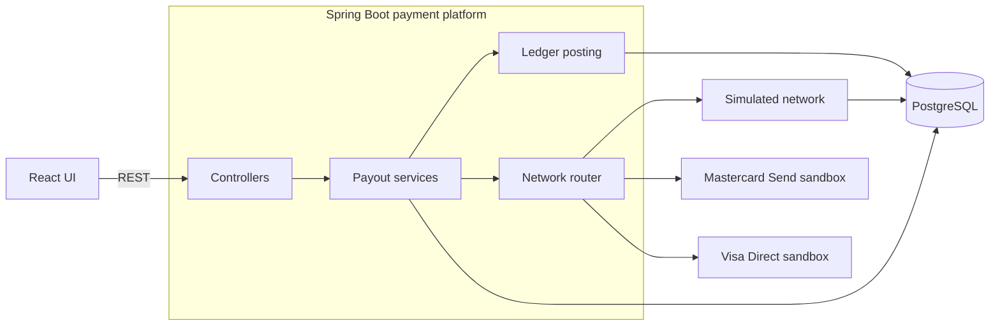
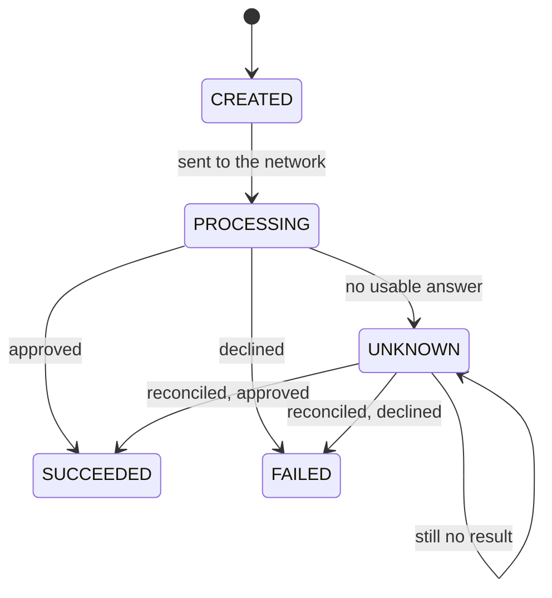

# Architecture

## Terms

| Term | Meaning |
| --- | --- |
| Payout | One payment the platform sends. The API and database say payout, the page says payment. |
| Payment platform | This application. It takes the request, talks to the payment network and keeps the records. |
| Payment network | The party that moves the money: the simulated network, Mastercard Send or Visa Direct. The code calls the adapter for a network a provider. |
| Reference | The payout's own UUID. Every request to the network carries it. |
| Idempotency key | A header chosen by the caller that makes creating a payout safe to repeat. |
| Workspace | A visitor's private, temporary set of payouts in demo mode. The page calls its expiry a session expiring. |

## Overview



The router sends each call to the network stored on the payout. The simulated network keeps its own record of payments in separate tables, so the platform and the network can disagree, as they can in production.

## Lifecycle



`Payout` allows only these changes, and a database check limits the status values. What the platform records for each answer:

| Answer from the network | Status | Ledger |
| --- | --- | --- |
| Approved | `SUCCEEDED` | Journal posted |
| Declined | `FAILED` | Nothing |
| No reply, HTTP 5xx or 408, an unexpected rejection | `UNKNOWN` | Nothing |
| Pending, or no result | `UNKNOWN` | Nothing |
| A request the adapter judges invalid | `FAILED` | Nothing |

A timeout says that no answer arrived. It does not say whether the network paid. So the platform never turns it into `FAILED`, and it never sends a second payment to find out.

## Idempotency

Two layers protect against paying twice.

**Caller to platform.** `POST /payouts` needs an `Idempotency-Key`. The platform stores a SHA-256 fingerprint of the recipient, amount and currency next to the key.

- Same key, same request: the original payout comes back with 200.
- Same key, different request or network: 409.
- Two requests with the same key at once: a unique constraint lets one insert win, and the other reads the winner.

**Platform to network.** The payout's UUID is the reference on every call. Sending again reuses it, so the network can recognise the payment.

- Mastercard: the same reference with `Repeat-Flag: true`.
- Visa: the transaction identifier, retrieval reference number and trace audit number are derived from the reference, so a resend carries the same identifiers.
- Simulated network: a unique constraint on the reference, and a resend returns the stored result.

## Uncertainty and reconciliation

Reconciliation asks the network about the payout's reference and applies the answer. Each attempt is stored.

| Network answer | Result |
| --- | --- |
| Approved | `SUCCEEDED`, journal posted |
| Declined | `FAILED` |
| Pending, unknown or no record | Stays `UNKNOWN` |

If the network has no record, the first request never arrived. Only then is it safe to send again, with the same reference (`POST /payouts/{id}/retry`).

An optional worker reconciles `UNKNOWN` payouts, and `PROCESSING` ones that went stale, which covers a crash after the network paid but before the platform saved the result. The delay doubles after each attempt, from 30 seconds up to 4 minutes. The public demo turns the worker off and the browser drives each step instead.

## Ledger

Confirming a payout posts one journal of two entries:

```text
DEBIT   SELLER_PAYABLE:<recipient>   100.00 SGD
CREDIT  CASH_CLEARING                100.00 SGD
```

The status change, its audit event and the journal commit in one transaction, and `LedgerPostingService` refuses to run outside one. PostgreSQL enforces the rest:

- One journal per payout, through a unique constraint.
- Deferred constraint triggers check at commit that a journal has exactly two entries, in opposite directions, with the same amount and currency. A bad journal rolls back the status change with it.
- Triggers reject updates and deletes of ledger and audit rows. Only expired demo workspaces can be removed.

Amounts are `BigDecimal` in the API and `NUMERIC(19,4)` in the database. Conversion to minor units follows ISO 4217 and never rounds. The page parses amounts as integers of minor units.

## Concurrency

- `Payout` carries a version, so two writers cannot overwrite each other. The loser gets 409.
- Unique constraints on the idempotency key, the journal and the network reference are independent backstops.
- The snapshot endpoint reads in a repeatable-read transaction, so a payout, its journal and its events always agree.
- Integration tests run concurrent creation, processing, retry and reconciliation against real PostgreSQL and assert one network payment and one journal.

## Public demo mode

With `DEMO_ENABLED=true` each browser tab gets a private workspace.

- The page sends a random workspace ID in `X-Workspace-Id`. Without the header the server uses a cookie, which is how curl works.
- A workspace expires after 6 hours without requests, or 30 minutes if it holds no payments. At most 3000 exist at once, each holds at most 40 payouts, and new ones are rate limited per address.
- Another workspace's payouts return 404. Idempotency keys are scoped to the workspace.
- Mastercard and Visa calls have per-workspace, per-minute and per-day budgets stored in PostgreSQL. Optional Cloudflare Turnstile gates them.
- The network adapters accept sandbox hosts only. Credentials stay on the server.

## Observability

Micrometer exports Prometheus metrics at `/actuator/prometheus`: network results, reconciliation outcomes, and gauges for payouts stuck in `UNKNOWN` or `PROCESSING`. In demo mode only `/actuator/health` is reachable, so to try the metrics run `DEMO_ENABLED=false docker compose --profile observability up`. That also starts Prometheus on port 9090 with alert rules for both gauges.

## Out of scope

The simulator models sending a payout and recovering from a failure. It does not model balances, fees, currency conversion, card authorization, settlement with a bank, or reversing a payout after it succeeded. A reversal would need its own lifecycle and a compensating journal, because changing an approved payout would erase history.
