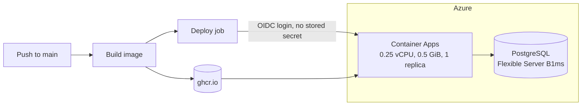

# Deployment

The public demo runs on Azure. The image is built by GitHub Actions, and Azure runs the container and the database.



- **App:** Azure Container Apps, one always-on replica, HTTPS only.
- **Database:** Azure Database for PostgreSQL Flexible Server, TLS required. Azure patches the host and the database.
- **Image:** `ghcr.io/yyan115/payment-processing-simulator`, tagged with the commit SHA and `latest`. Deploy by SHA. A repeated `latest` is not pulled again.

## Pipeline

[`.github/workflows/image.yml`](../.github/workflows/image.yml) runs on every push to `main`, every Monday and on demand.

1. The `image` job builds and pushes the image. The Monday run rebuilds without a cache, so base image fixes arrive without a code change.
2. The `deploy` job signs in to Azure with OpenID Connect, updates the app to the new SHA and waits for `/actuator/health`. It uses the `production` environment, so the repository's Deployments box links to the live URL.

The `deploy` job runs only when the repository variables `AZURE_CLIENT_ID`, `AZURE_TENANT_ID` and `AZURE_SUBSCRIPTION_ID` exist. They are identifiers, not secrets. No Azure credential is stored in GitHub.

## First-time setup

```bash
az login
ops/azure/deploy.sh        # resource group, database, environment and app
ops/azure/providers.sh     # optional: Mastercard and Visa credentials from .env, as Container App secrets
```

`deploy.sh` tries each region the subscription allows until the database can be created, and saves the generated database password to `~/.config/payment-processing-simulator/azure/credentials.env`. It is safe to run again.

To let the pipeline deploy:

1. Create a user-assigned managed identity in the resource group.
2. Add a federated credential for GitHub Actions on it. Its subject must match the one GitHub presents for the `production` environment. GitHub uses the form `repo:<owner>@<owner-id>/<repo>@<repo-id>:environment:production`. A failed login prints the exact value.
3. Give the identity the Contributor role on the resource group only.
4. Set the three repository variables to the identity's client ID, the tenant ID and the subscription ID.

## Operating notes

- A change to a secret takes effect in a new revision. Changing any environment variable, or the image, creates one.
- Mastercard and Visa credentials are Container App secrets and never appear in the image or the repository.
- Calls to the sandboxes are budgeted per workspace, per minute and per day. The defaults are in [`.env.example`](../.env.example).

## Bot check (optional)

Cloudflare Turnstile can gate the Mastercard and Visa networks. Create a managed widget for the app's hostname, then set:

```dotenv
TURNSTILE_REQUIRED=true
TURNSTILE_SITE_KEY=<public widget key>
TURNSTILE_SECRET_KEY=<private key>
TURNSTILE_HOSTNAME=<hostname of the deployment>
```

The browser asks for a check before a sandbox payment. The server verifies the token, hostname and action, then allows the workspace to use the sandboxes until it expires. The simulated network stays open. With `TURNSTILE_REQUIRED=true` and a missing value, the app refuses to start instead of running unprotected.
